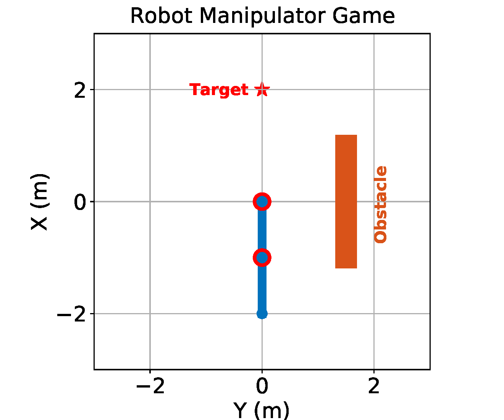
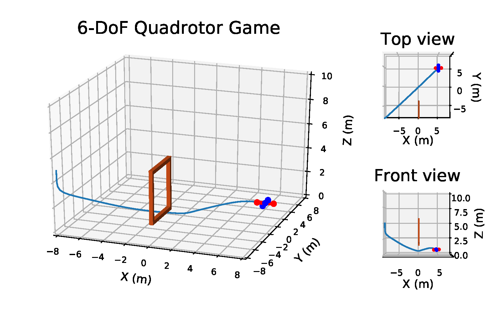

# Learning-from-Directional-Corrections

This project is an implementation of the paper _**Learning-from-Incremental-Directional-Corrections**_, 
co-authored by Wanxin Jin, Todd D. Murphey, and Shaoshuai Mou. Please find more details in
* Paper: https://arxiv.org/abs/2011.15014 for technical details.
* Blog: https://wanxinjin.github.io/posts/lfdc for a brief problem introduction.

## Project Structure
The current version of the project consists of following folders or files:
* _**LFC**_ : a package including an optimal control solver and a maximum volume inscribed ellipsoid (MVE) solver.
* _**JinEvn**_ : an independent package providing various robot environments to simulate on.
* _**Simulations**_ : a folder including different simulation examples used in the paper. Each python
script can be run directly. 
* _**run_robotarm_game.py**_ : an entry script to the  two-link robot arm game. See the details below.
* _**run_uav_game.py**_ : an entry script to the  6-DoF quadrotor game. See the details below.

## Dependency Packages

Please make sure that the following packages have already been installed before you use the  codes.
* CasADi: used for solving optimal control. (Version >= 3.5.1. Info: https://web.casadi.org/)
* Numpy: used for matrix computation. (Version >= 1.18.1. Info: https://numpy.org/)
* Pynput: used for keyboard interface when run the human-robot games. (Version >=1.7.1. Info: https://pythonhosted.org/pynput/)
* Cvxpy: used for solving MVE. (Version >= 1.0.31. Info: https://www.cvxpy.org/)
* Mosek: used for solving MVE (core solver). (Version >=9.2.16. Info: https://www.mosek.com/. NOTE: license required)

When you run the above examples or games, I recommend to use  Pycharm IDE (https://www.jetbrains.com/pycharm/. Version >=2020.2.2), where
I have tested all the codes and it runs smoothly.

Note that Mosek requires a license before to use. You can request an academic license at https://www.mosek.com/products/academic-licenses/.
After you have installed Mosek and its license. Please run _**test_mosek_solver.py**_ to test if your installed Mosek work properly.

## How to Play the Human-Robot Games?

<table style=" border: none;">
<tr style="border: none;text-align:center;">
<td style="border: none; text-align:center;" > 
     
  
 The robot arm game. The goal is to let a human player  teach the robot arm  to learn a valid cost function  by applying incremental directional corrections, such that it successfully moves from the initial condition (current pose)  to  the target position (upward pose) while avoiding the obstacle.  
   

</td>
<td style="border: none; text-align:center;"> 
   

 The 6-DoF quadrotor  game. The goal of this game is to let a human player to  teach a 6-DoF quadrotor system to learn a valid control cost function by providing  directional corrections, such that it can successfully fly from the initial position (in bottom left),  pass through a  gate (colored in brown), and finally land on the specified target  (in upper right). 

</td>
</tr>
</table>

### 1. Robot-Arm Game
You can directly run _**run_robotarm_game.py**_ to enter the two-link robot-arm game.

The goal of this game is to let a human player  teach the robot arm  to learn a valid cost function by 
applying incremental directional corrections, 
such that it successfully moves from the initial condition 
(downward pose)  to  the target position (upward pose) 
while avoiding the obstacle.

To play the  robot arm game, a human player uses a keyboard as the interface  to provide directional corrections. 
We  customize the (`up`, `down`, `left`, `right`)
keys in a keyboard and associate them  with  the directional corrections as instructed in the following table.

|   Keys  	| Directional correction 	|               Interpretation               	|
|:-------:	|:----------------------:	|:------------------------------------------:	|
|   `up`  	|        a= [1, 0]       	| add a counter-close-wise torque to Joint 1 	|
|  `down` 	|       a= [-1, 0]       	|     add a close-wise torque to Joint 1     	|
|  `left` 	|        a= [0, 1]       	| add a counter-close-wise torque to Joint 2 	|
| `right` 	|       a= [0, -1]       	|     add a close-wise torque to Joint 2     	|

During the game,  the algorithm is listening to which key(s) you have  hit, and other keys except the above ones will not be recognized.
The game procedure is as follows:

1. The robot arm  plans its motion based on its current control cost function, and then graphically executes the planned motion on the screen. 
2. While the robot is executing, the human player (you) can press one or multiple key(s) (see the above table instruction) to correct the robot.
3. Once the algorithm detects that you have pressed one or multiple keys, the command line will prompt you 
which key(s) you have hit and also the keystroke time (i.e., the correction time) ---- 
at which time step in the robot's motion horizon the key is pressed. Then, the  interface will translate your key pressing 
information into the directional correction based on the above table.
4. The robot arm will use such the directional correction 
to update its  control cost function. Go to Step 1.

This process repeats until the robot successfully avoids the obstacle and reaches the target position --- mission accomplished!

### 2. 6-DoF Quadrotor Game
You can directly run _**run_uav_game.py**_ to enter the 6-DoF quadrotor game.

The goal of this game is to let a human player to  teach a 6-DoF quadrotor 
system to learn a valid control cost function 
by providing  directional corrections, 
such that it can successfully fly from the initial position (in bottom left), 
 pass through a  gate (colored in brown), 
 and finally land on the specified target  (in upper right).

In the 6-DoF quadrotor game, a human player uses a keyboard  as the interface  
 to provide directional corrections. Specifically, the player can use the (`up`, `down`, `w`, `s`, `a`, `d`) keys, which are
associated  with specific directional correction signals,  as listed in the following table.

|  Keys  	|    Direction correction    	|                   Interpretation                   	|
|:------:	|:--------------------------:	|:--------------------------------------------------:	|
|  `up`  	|   T1=1, T2=1, T3=1, T4=1   	|    Upward force applied at COM of the quadrotor    	|
| `down` 	| T1=-1, T2=-1, T3=-1, T4=-1 	|   Downward force applied at COM of the quadrotor   	|
|   `w`  	|   T1=0, T2=1, T3=0, T4=-1  	| Negative torque along x body-axis of the quadrotor 	|
|   `s`  	|   T1=0, T2=-1, T3=0, T4=1  	| Positive torque along x body-axis of the quadrotor 	|
|   `a`  	|  T1=1, T2=0, T3=-1, T4=-0  	| Negative torque along y body-axis of the quadrotor 	|
|   `d`  	|  T1=-1, T2=0, T3=1, T4=-0  	| Positive torque along y body-axis of the quadrotor 	|

During the game,  the algorithm is listening to which key(s) you have  hit, and other keys except the above ones will not be recognized.
The 6-DoF quadrotor game procedure is as follows:

1. The quadrotor plans its motion based on its current control cost function, then graphically executing its planned motion on the screen.
2.  While the quadrotor is executing (flying), the human player (you) can press one or multiple key(s) (see the above table instruction) to correct the quadrotor.
3. Once the algorithm detects that you have pressed one or multiple keys, the command line will prompt you 
which key(s) you have hit and also the keystroke time (i.e., the correction time) ---- 
at which time step in the robot's motion horizon the key is pressed. Then, the  interface will translate your key pressing 
information into the directional correction based on the above table.
4. The quadrotor will use such the directional correction 
to update its  control cost function. Go to 1.

This process repeats
until the quadrotor successfully flies from the initial position, passes through the  gate, 
and finally lands on the specified target --- mission accomplished!

 
 # Contact Information and Citation
 
If you have encountered an issue in your use of the codes/games (the codes are under regularly update), please feel free to let me known via email:
* Name: Wanxin Jin (he/his)
* Email: wanxinjin@gmail.com 

If you find this project/paper helpful in your research, please consider citing our paper.